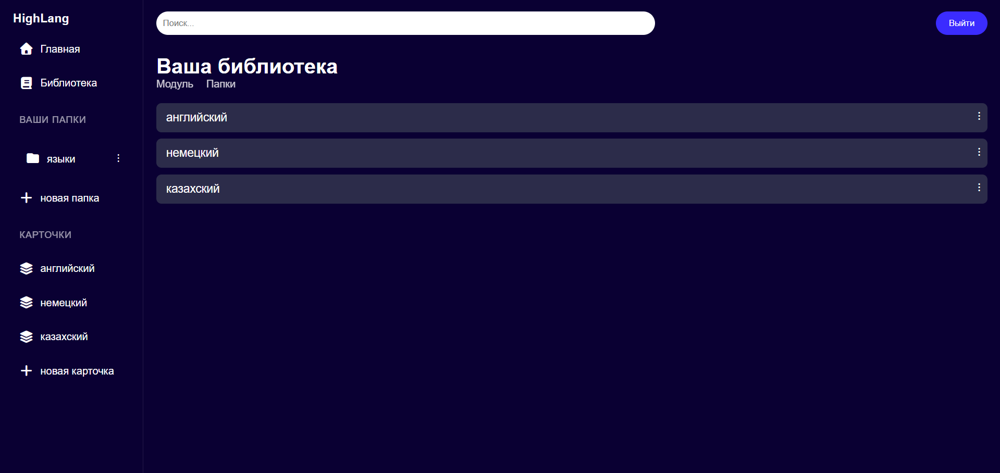
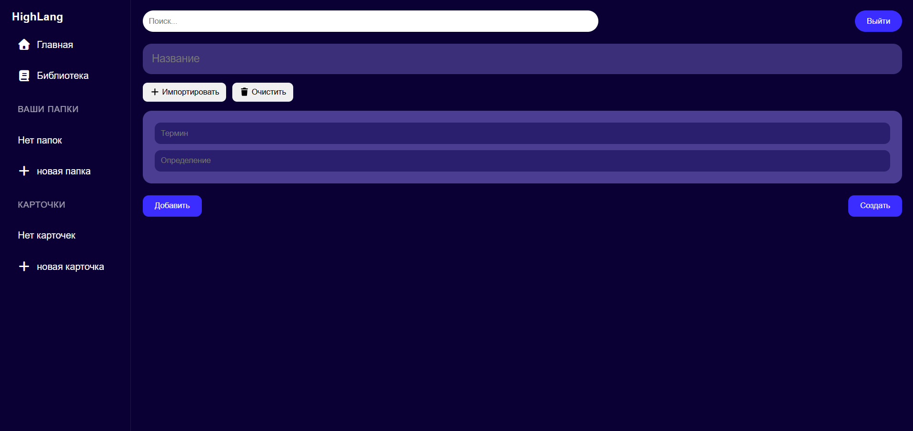
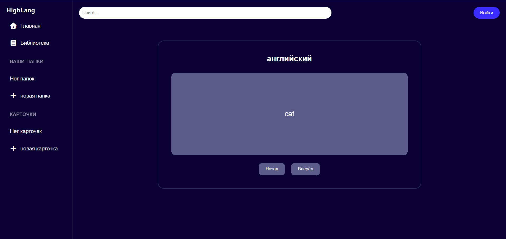

HighLang — веб-приложение для создания, хранения и изучения языков в иде карточек. 
Позволяет пользователям создавать папки, модули и карточки, а также изучать их в интерактивной библиотеке.

Основные возможности:
Создание и управление папками
Создание модулей и добавление их в папки
Добавление карточек в модули
Удобная библиотека для просмотра карточек и папок
Адаптивный дизайн для мобильных, планшетов, ноутбуков и больших экранов
Модальное окно выбора существующих модулей для добавления в папку
Удаление конкретной карточки или модуля через кнопку корзины
Встроенный режим обучения (просмотр и переворот карточек)

# Клонировать репозиторий
git clone https://github.com/ваш_проект/HighLang.git
cd HighLang

# Установить зависимости
npm install

# Запуск приложения в режиме разработки
npm start

# Сборка для продакшена
npm run build

Руководство пользователя:
1. Авторизация
Страница входа с полями Email и Пароль
Кнопка Войти и ссылка на регистрацию
2. Панель навигации (Sidebar)
Папки: список папок
Модули: добавление и удаление модулей
Карточки: просмотр карточек внутри модулей
Кнопка + для добавления новой папки или модуля
3. Добавление карточек и модулей
Кнопка + открывает модальное окно
Выбор существующего модуля из списка или создание нового
Карточки можно удалять через кнопку корзины
4. Библиотека
Две вкладки: Модули и Папки
Вкладка Модули показывает все карточки
Вкладка Папки показывает папки и их модули
Нажатие на карточку открывает просмотр с возможностью изучения (переворот)
5. Режим обучения
Выбор карточки открывает интерактивную карточку с фронт/бэк
Кнопки Следующая, Предыдущая для навигации

Скриншоты интерфейса:
Главная библиотека

Модальное окно добавления модуля

Просмотр карточки

Технологии
React 18
React Hooks (useState, useEffect)
CSS3 (Flexbox, Grid, медиа-запросы)
FontAwesome для иконок
Поддержка адаптивности на все устройства
Vercel для деплоя

Деплой
Приложение полностью готово к деплою на Vercel
Для деплоя: npm run build → загрузить папку build в Vercel
Работает без сервера (данные хранятся в state), легко подключить API позже